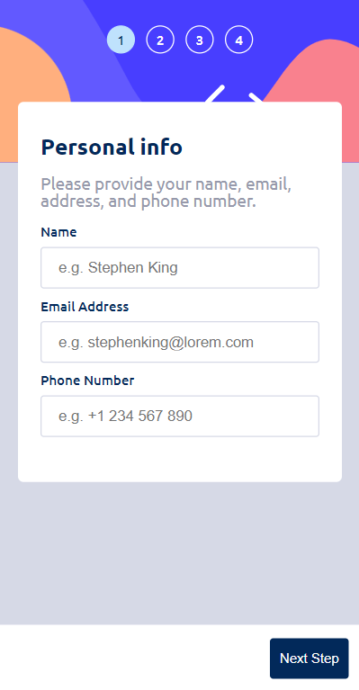
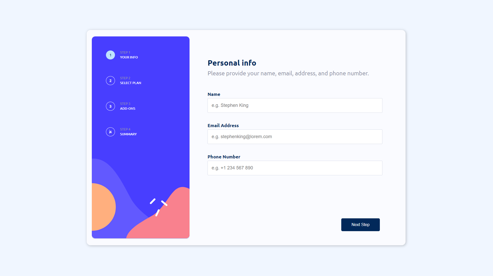
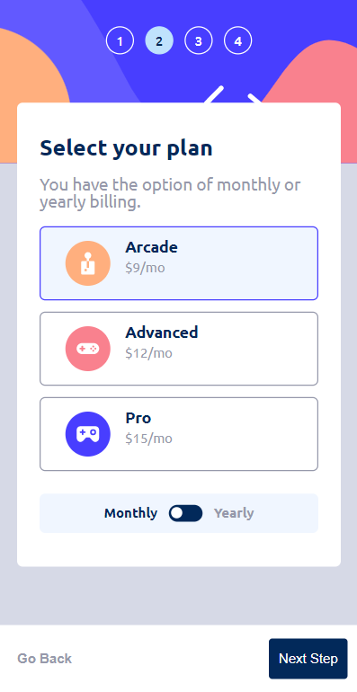
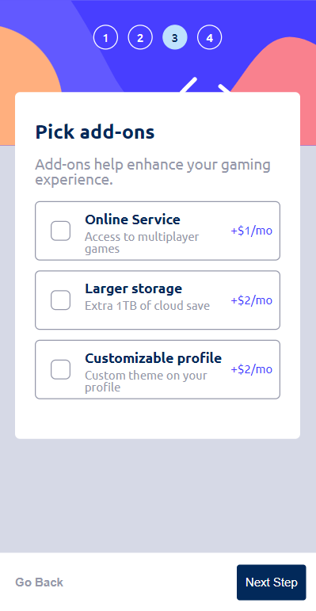
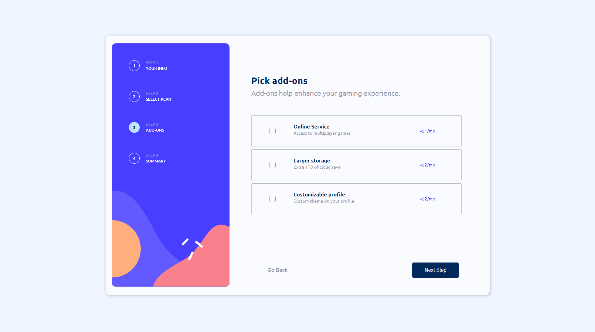
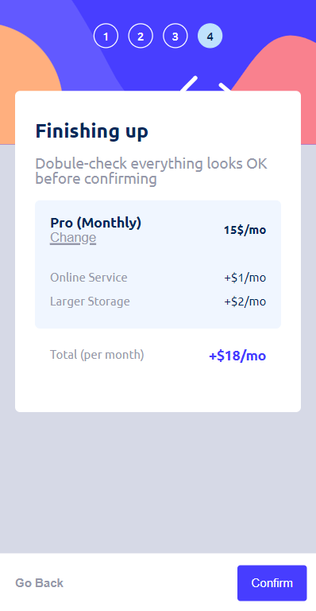
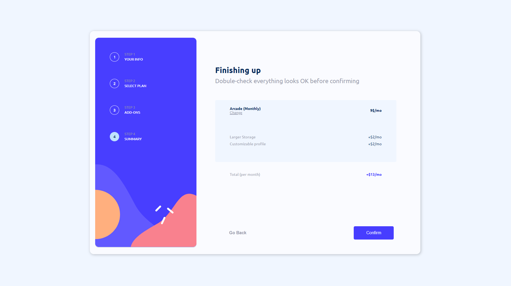
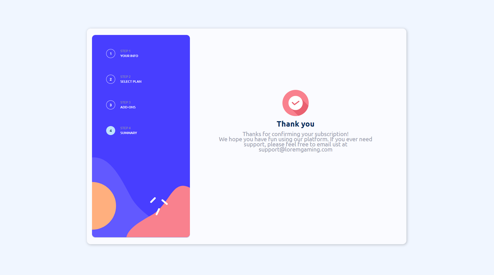

# Frontend Mentor - Multi-step form

Projekt do wykonania z [Frontend Mentor](https://www.frontendmentor.io)

### [mpolakk.github.io/Multi-Step-Form-Main/](https://mpolakk.github.io/Multi-Step-Form-Main/)
### **Rozwiązanie z SS'ami znajduje się na samym dole**

## **Projekt**

Formularz w dwóch wersjach mobile i desktop(1440px). Wykonałem minimalną walidację przy wprowadzaniu danych. O ile z imieniem i nazwiskiem(sprawdzenie spacji, maksymalnie dwóch członów, dużej pierwszej litery w każdym z członów) i mailem(sprawdzenie symbolu "at" oraz kropki w drugiej części emaila) nie było dużego problemu tak z numerem telefonu napotkałem kilka problemów.

Chciałem uzyskać efekt autouzupełniania poprawną formą numeru telefonu dla wszystkich kierunkowych po wpisaniu wszystkich cyfr ostatecznie zostało tak jak miało być w projekcie czyli +1. Użyłem do tego metody replace() i REGEX'a. Walidacja wykonuje się przez useEffect przy każdej zmianie stanu, nie wiem czy to dobrze wpływa na optymalizacje.

Stan aplikacji jest postawiony na Reduxie. Być może znalazłoby się kilka zbędnych wartości które można by usunąć bądź zamienić i nie mam pewności czy użycie createSlice jest poprawne(sprawdziłem i createSlice zastępuje stare metody implementacji reduxa i usuwa zbędny boilerplate).

## **Do poćwiczenia**

Można jeszcze bardziej wykorzystać potencjał Reacta i zrobić kilka mniejszych komponentów dla elementów które się powtarzają.

Napisać jakiś backend z bazą danych.

## **Wyniesione doświadczenie z projektu**

Napewno bardziej przemyśleć plan nazewnictwa i rozdzielenia na komponenty. Gdybym wrócił do tego projektu za kilka miesięcy dłuższą chwile zajęło by przypomnienie sobie co gdzie jest.

Napotkałem się z jednym bardzo poważnym problemem który mnie męczył czyli podwójne wywołanie useEffect nawet przy zależnościach z pustą tablicą. Problemem był StrictMode co oczywiście było zawarte w dokumentacji no ale komu by się chciało tam zaglądnąć :>

## **Rozwiązanie**

### **First Step**
|  |  |
| :---------------------------------------------------------: | :--------------------------------------------------: |
|                      *Frontend Mentor*                      |                    *My Solution*                     |

|  |
| :----------------------------------------------: |
|                *Frontend Mentor*                 |

|  |
| :-------------------------------: |
|           *My Solution*           |

### **Second Step**

|  |  |
| :---------------------------------------------------------------: | :--------------------------------------------------: |
|                         *Frontend Mentor*                         |                    *My Solution*                     |

|  |
| :------------------------------------------------------: |
|                    *Frontend Mentor*                     |

|  |
| :-------------------------------: |
|           *My Solution*           |

### **Third Step**

|  |  |
| :-----------------------------------------------------------------: | :--------------------------------------------------: |
|                          *Frontend Mentor*                          |                    *My Solution*                     |

|  |
| :------------------------------------------------------: |
|                    *Frontend Mentor*                     |

|  |
| :-------------------------------: |
|           *My Solution*           |

### **Fourth Step**

|  |  |
| :-----------------------------------------------------------------: | :--------------------------------------------------: |
|                          *Frontend Mentor*                          |                    *My Solution*                     |

|  |
| :------------------------------------------------------: |
|                    *Frontend Mentor*                     |

|  |
| :-------------------------------: |
|           *My Solution*           |

### **Fifth Step**

|  |  |
| :---------------------------------------------------------: | :--------------------------------------------------: |
|                      *Frontend Mentor*                      |                    *My Solution*                     |

|  |
| :----------------------------------------------: |
|                *Frontend Mentor*                 |

|  |
| :-------------------------------: |
|           *My Solution*           |

